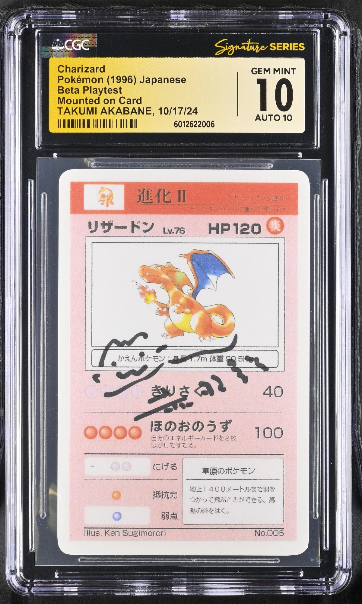
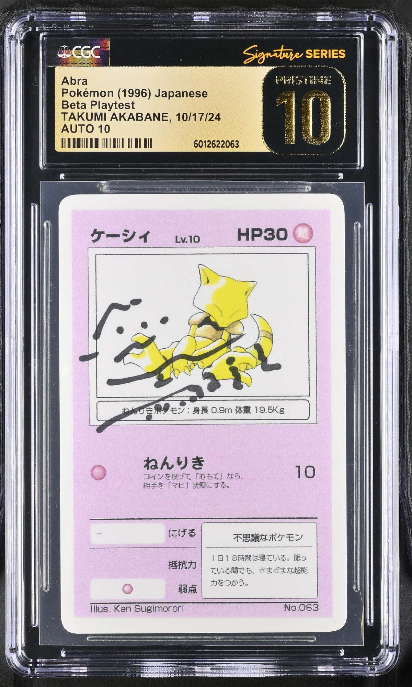
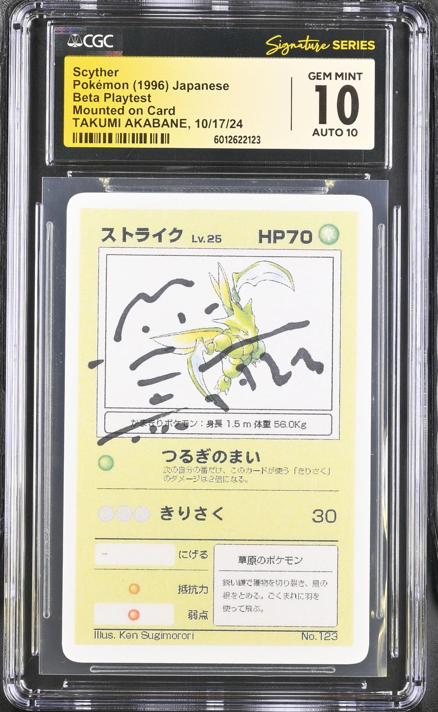

## CGC Witnessed Akabane Signed Cards
I have no plans to post everytime a new set of cards hits the market, but since this is the first time cards from "Akabane's Personal Collection" have been signed by Akabane and witnessed by CGC, I believe it's worth posting about.

    
    
    

As you can see from the images above, a number of Beta Playtest & three Alpha Presentation cards have gone up for sale at Alt. These cards are graded in CGC's "Signature Series" which gives them a gold label and certifies that CGC witnessed the signature happen.

While we've seen a few people post their cards signed by Akabane online, this is the first time I have seen his signature as part of the "Signature Series" and not just "Authentic Autograph". To me, this makes these the grail of all prototype cards in the Pokemon TCG. Cards from his collection and signed by the man himself.

You can find the cards up for sale by visiting this link:
https://app.alt.xyz/liquid-auctions?query=Akabane&sortBy=highest_price_first

Here's the direct link to the Alpha Presentation Charizard if you're just interested in seeing how high the price can go: https://app.alt.xyz/liquid-auctions/select-listing?ids=55c75d61-58fc-4eaa-ac5e-72806ac0fd69

If I had disposable income, I'd probably be bidding on the Beta Playtest Scyther to complement my unsigned one. Good luck to all who are able to snag one of these while they last. To me, these are incredible pieces of Pokemon TCG history and I hope they all make it into the hands of real enthusiests.

---

Message me on Instagram [@MattCollects64](https://www.instagram.com/mattcollects64/) to let me know your thoughts on these cards, and please let me know if you snag any for your collection. I love seeing people share their grails.

