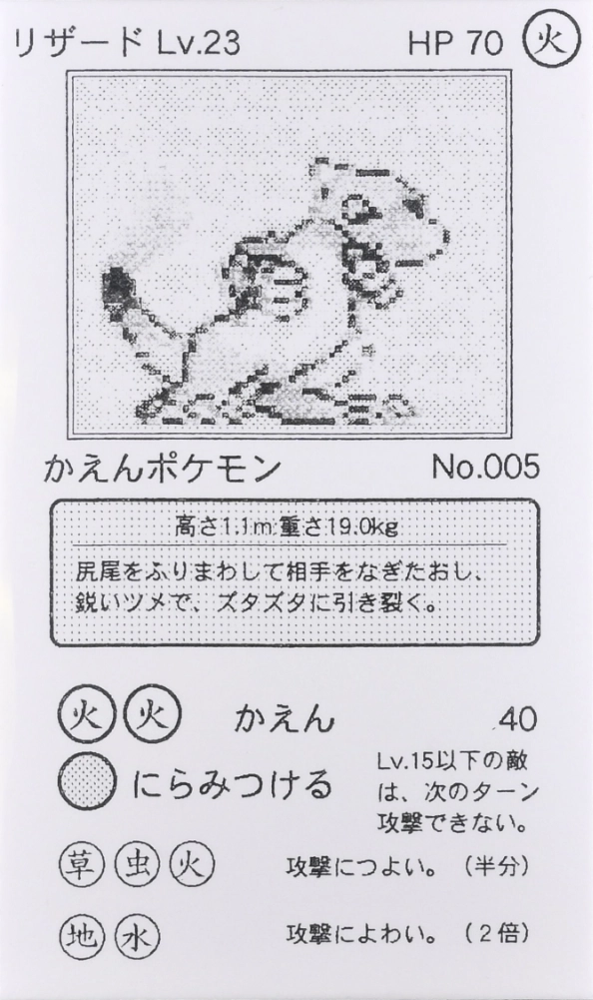
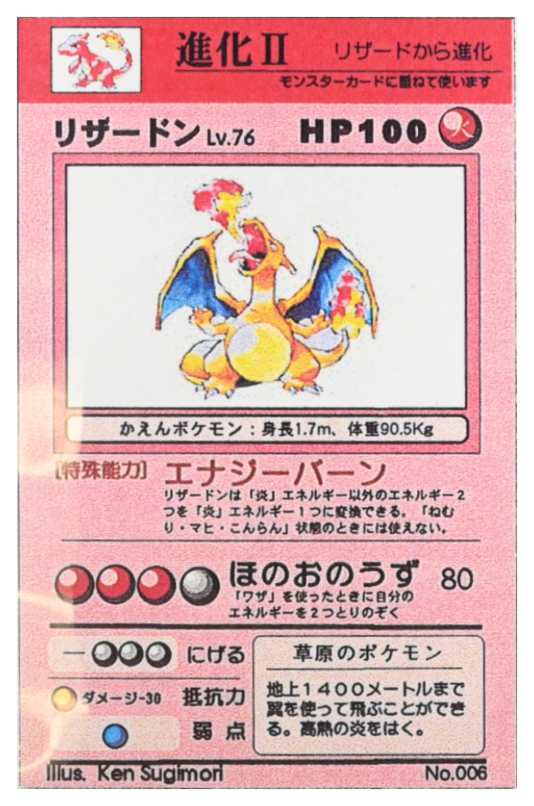
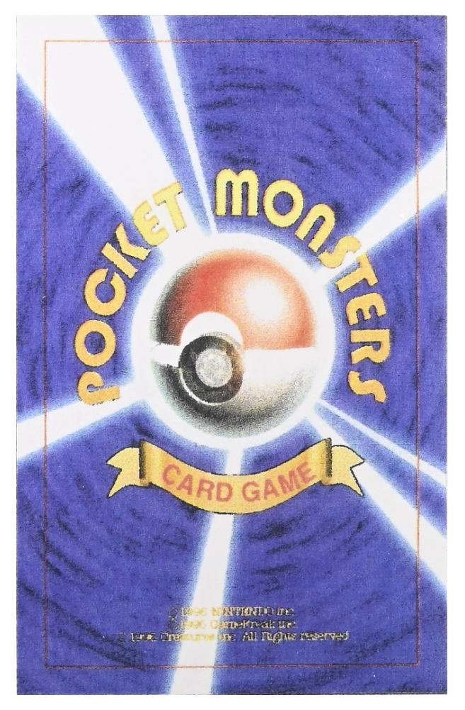
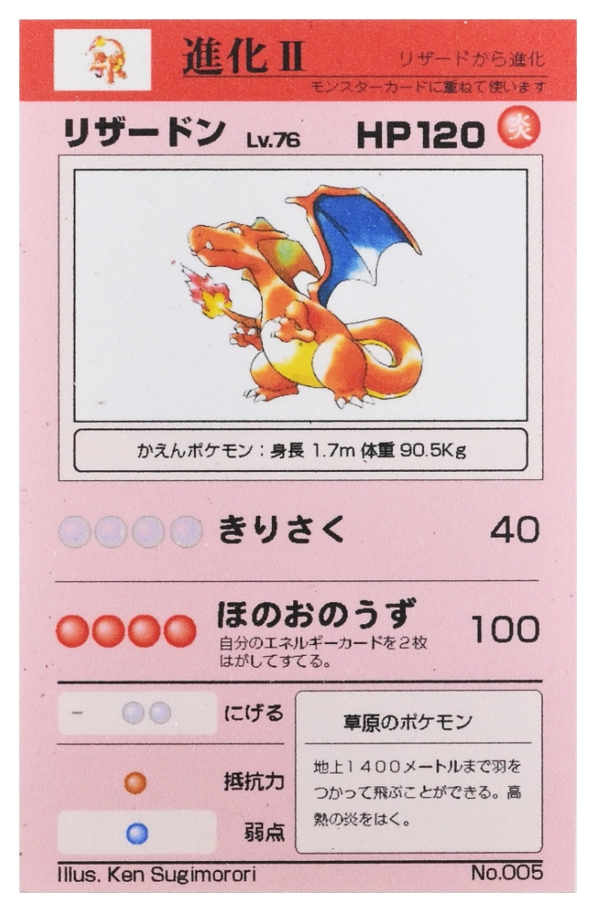
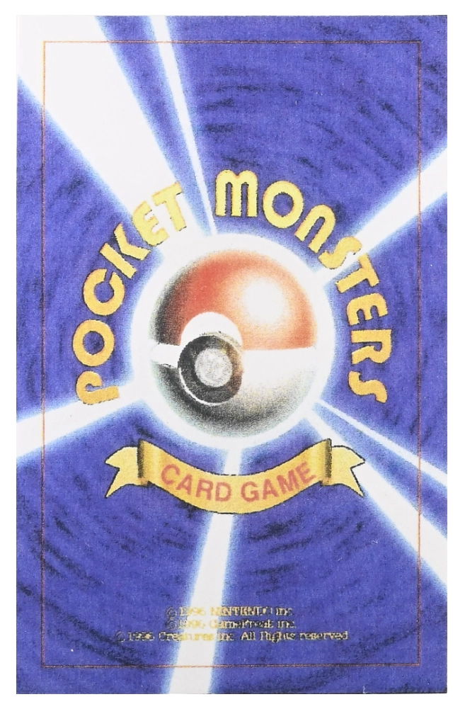
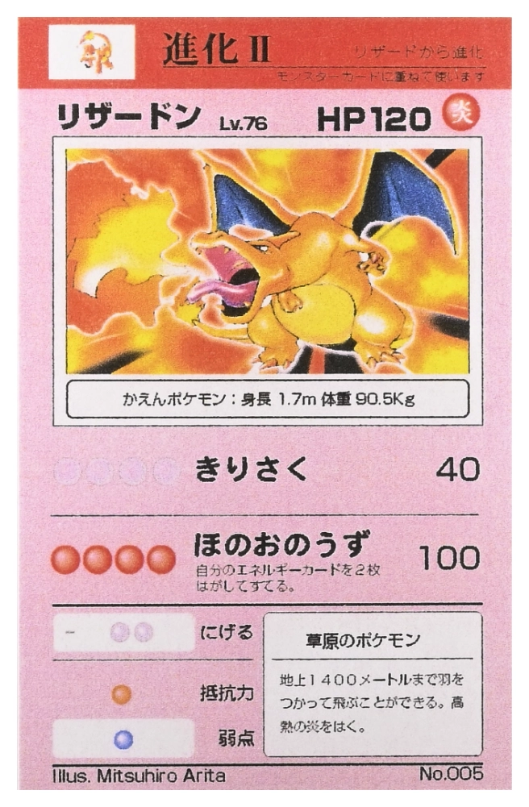
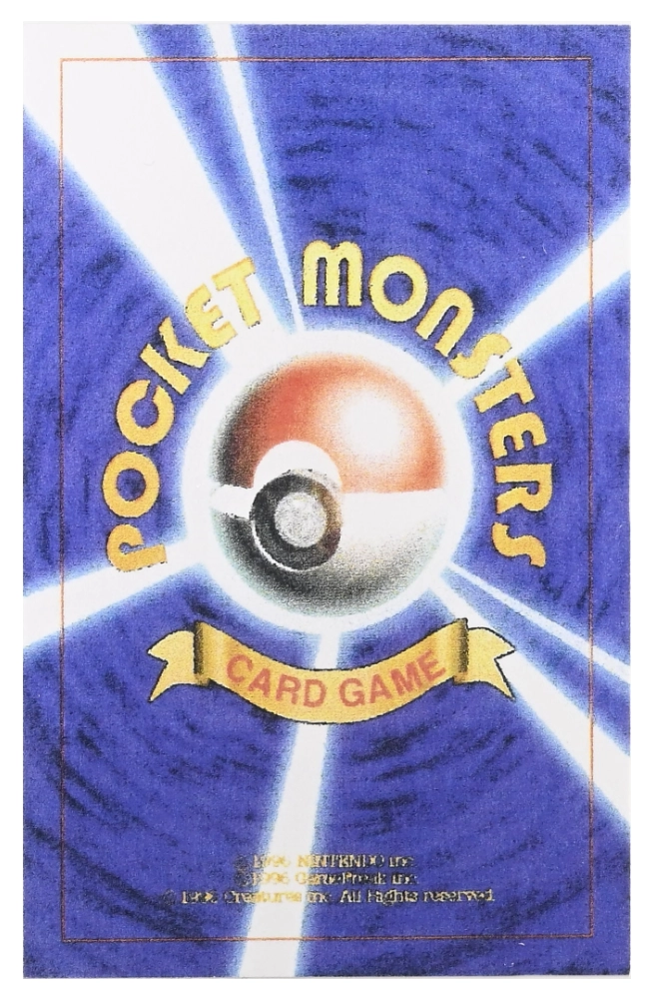
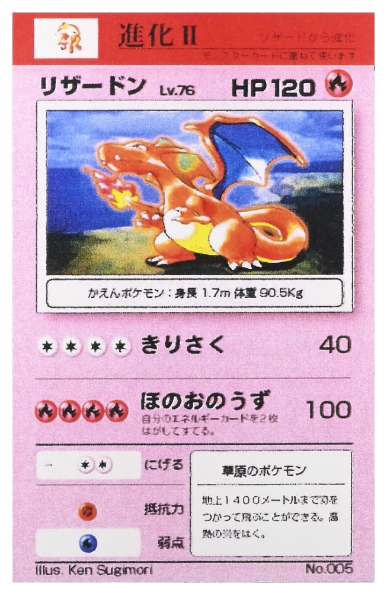
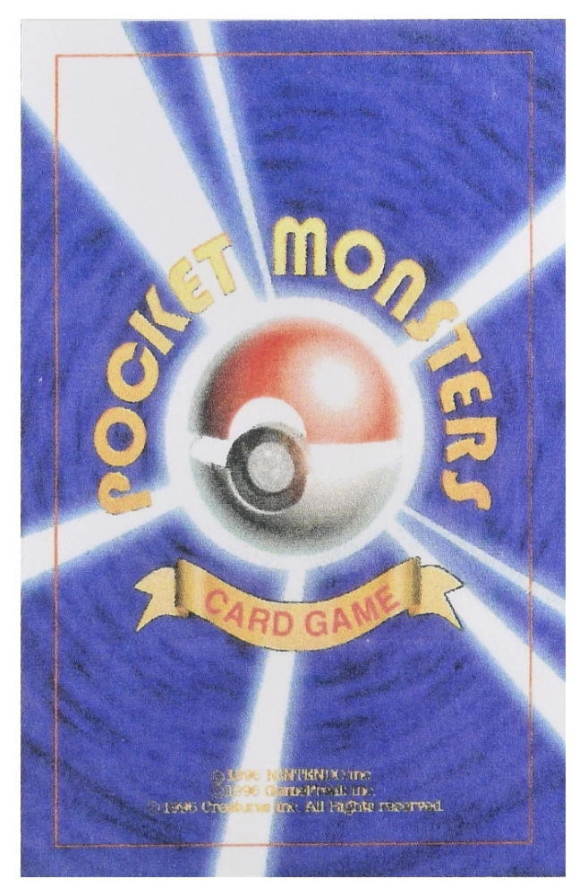
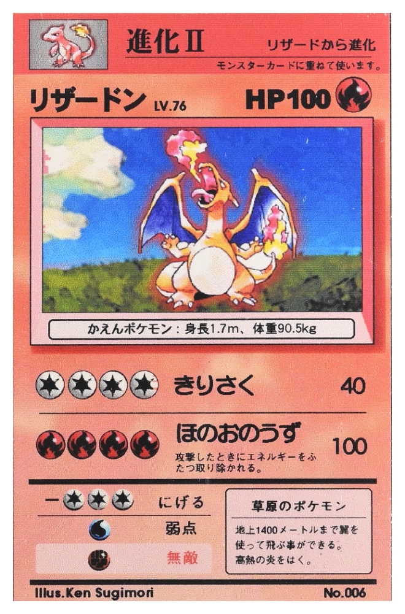

For now, I have no intention of going into the history of who released these cards to the public and how they were verified as authentic. This has already been covered by many people like CGC cards, but I could write a post in the future if needed.

## Overview
### Why make this post/site?
There has been a lot of confusion in the community around the Pokemon pre-release cards lately, and even some cards being listed incorrectly on auction houses.

I want to make a single post that explains every main category of the pre-release cards so I, and the community, know exactly what we are looking at when these cards popup in future discussions.

### Disclaimers
- The information in this post and on the site are based on what I've read from the authenticator (CGC), some of the auction houses selling the cards, instagram videos by GemMintPokemon, excellent discussions over at the EliteFourm, and discussions I've had with individuals via DMs.
- I do not represent anyone from the TCG or have insider information. Information in this article may be inaccurate and need to be corrected over time.
- You should do your own research and not make purchase decisions based on what I've assembled here. I am not responsible for your decisions.
- All photos of the cards on this page came from CGC's scans. I claim no ownership of the photos. I did cleanup the photos and remove them from the slabs to make it easier to view them. This site is being published for informational purposes only. None of this is commercial or for profit.

---

## Alpha Prototype (1995)
The Alpha Prototype cards were produced in 1995, and are currently the earliest form of real test/demo of what a Pokemon TCG could actually look like (excluding the Seadra Proof of Concept card since it was a one off).  

    
    

 - Set includes 26 Pokemon
 - Printed on thick card stock (apparently thicker than normal TCG cards)
 - Used flipped sprites from the GameBoy games for the Pokemon
 - Are black and white
 - Nothing on the back of the card.

---

## Alpha Playtest (1996)
The Alpha Playtest cards are much closer to what you are familiar with seeing from the Pokemon TCG. They feature art from Ken Sugimori and only include Pokemon and Trainer cards from the Base Set.

    
    

 - Set includes Base Set Pokemon and Trainer cards
 - Printed on paper and then stuck to card stock
 - Art is now illustrations by Ken Sugimori
 - Artwork has no backgound (with the exception of Porygon)
 - Cards are in color (background of card is a solid color)
 - Back of the card has a low-res, but colored version of the Pocket Monsters back design.

---

## Beta Playtest (1996)
The Beta Playtest cards are the first time we see cards from the Fossil and Jungle Sets; all 151 Pokemon make an appearance in this testing phase. 

    
    

 - Set includes Trainer cards and all 151 Pokemon for the first time
 - Printed on paper and then stuck to card stock
 - Illustration credit misspells Ken Sugimori's name as "Sugimorori"
 - Artwork has no backgound
 - Cards are in color (background of card is a solid color)
 - Back of the card has a low-res, but colored version of the Pocket Monsters back design.
 - Some Pokedex numbers may be wrong. Charizard for example shows incorrectly as No.005.

---

## Delta Playtest (1996)
The Delta Playtest cards appear to only represent the starter Pokemon and their evolutions. At this time, no other Delta Playtest Pokemon have surfaced. 

    
    

 - Set includes only the starters and their evolutions.
 - Printed on paper and then stuck to card stock
 - Illustrations now by Mitsuhiro Arita and Ken Sugimori (spelled correctly.
 - Illustrations represent what we see in the official launch.
 - Artwork has full character and background
 - Cards are in color (background of card is a solid color)
 - Back of the card has a low-res, but colored version of the Pocket Monsters back design.
 - Some Pokedex numbers may be wrong. Charizard for example shows incorrectly as No.005.

---

## Alpha Presentation (1996)
The Alpha Presentation cards appear to only represent a limited number of Pokemon: Venusaur, Charizard, Blastoise, pikachi, Clefairy, Machoke, Porygon, Dragonite, and Mewtwo.

    
    

 - Set includes limited number of Pokemon.
 - Uncertain how they were printed (hopefully someone who owns one can reach out)
 - Illustrations by Ken Sugimori
 - Artwork has full character and background
 - Cards are in color (background of card is a solid color)
 - Energies finally have symbols in the attack area.
 - Back of the card has a low-res, but colored version of the Pocket Monsters back design.
 - Some Pokedex numbers may be wrong. Charizard for example shows incorrectly as No.005.

---

## Beta Presentation (1996)
The Beta Presentation cards appear to be the rarest of all the pre-release cards and are believed to be the cards form the early previews of the Pokemon TCG in the Corocoro magazine.

    
    

 - Only three Pokemon are graded or known to exist publically: 1 Charizard, 1 Clefairy, and 1 Mewtwo.
 - Uncertain how they were printed (if someone owns of of these, please reach out)
 - Illustrations by Ken Sugimori
 - Artwork has full character and background
 - Cards are no longer a single color and instead have a patterned background like you see on the officially released cards.
 - Energies also have symbols in the attack area.
 - There is no back on these cards. It is just solid white.
 - Everything looks clearer and more bold (including text).
 - Charizard's Pokedex number is finally corrected to No.006

---
## Wrap Up
### A Work in Progress
The information around these cards could change, additional categories of the pre-release cards could surface, or more. I will try to keep this site updated as major information is released, but I will reiterate that you should do your own research and come to your own conclusions. I wanted a site that clearly outlined what I believe the current state of these cards looks like, but that does not mean I, or the community, are 100% accurate. I am not responsible for any actions you take.
### Thanks / Credits
1. Thank you to the EliteFourm for being so informative and collaborative over the last few months. The community there is wonderful and has really done an excellent job discussing these cards.  
2. Thank you to CGC for grading/authenticating these cards and providing a wealth of knowledge to the community.  
3. Thank you to all of those who spoke with me through DMs and helped me clear up any confusion I had on these cards.
### Other Cards/Variants
Other pre-release cards do exist along with slight variations within the main categories above. I may make a seperate post explaining these in the future.